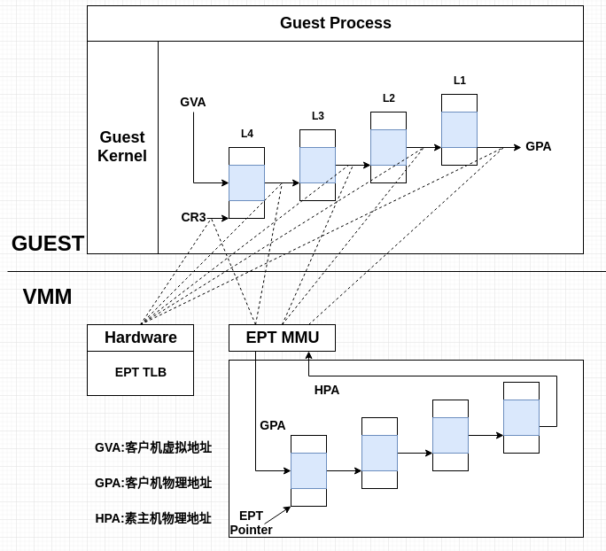
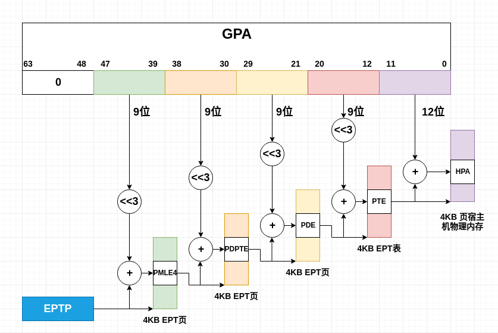

# 内存虚拟化
<!-- vscode-markdown-toc -->
* 1. [EPT](#EPT)
	* 1.1. [EPT原理](#EPT-1)
	* 1.2. [EPT的硬件支持](#EPT-1)
	* 1.3. [VPID](#VPID)

<!-- vscode-markdown-toc-config
	numbering=true
	autoSave=true
	/vscode-markdown-toc-config -->
<!-- /vscode-markdown-toc -->
- - -

VT-x提供了Extended Page Table(EPT)技术，直接在硬件上支持GVA-GPA-HPA的两次地址转换，极大的降低了内存虚拟化的难度，也进一步提高了内存虚拟化的性能。
_ _ _
此外，为了进一步提高TLB的使用效率，VT-x还引入了Virtual Processor ID(VPID)功能，进一步增加了内存虚拟化的性能。
- - -
##  1. <a name='EPT'></a>EPT
- - -
###  1.1. <a name='EPT-1'></a>EPT原理

_ _ _
EPT的原理可参见如下图：
_ _ _


_ _ _
假设客户机页表和EPT页表都是4级页表，CPU完成一次地址转换的基本过程如下(必须明确的是在GUEST中的CR3寄存器以及L4-L1都保存的都是GPA，所以GUEST中每一次差学下级页表的时候都需要EPT进行转换)：
_ _ _
```c
1.Guest CR3保存的是Guest L4页表的基地址GPA，所以CPU需要EPT页表来实现Guest CR3 GPA->HPA的转换。CPU会首先查看EPT TLB中是否有对应的转换，如果没有CPU会进一步查找EPT页表，如果还没有CPU会抛出EPT Violation异常，然后交由VMM处理。

2.获得L4页表后，CPU根据GVA和L4页表项的内容来获取L3页表项的GPA。获得L3页表项的GPA后，CPU同样会执行1.描述的查找工程

3.同样L2、L1页表也会执行上述的转换和查找。所以在最坏的情况下(每次查找EPT TLB未命中且EPT页表也没有对应的转换关系)时需要20次内存访问。
```
- - -

###  1.2. <a name='EPT-1'></a>EPT的硬件支持
_ _ _
为了支持EPT，VT-x规范在VMCS的==VM-Execution==控制域中提供了==Enable EPT==字段。VM-Entry时该字段被置为==1==，EPT功能就会被启用。
_ _ _
EPT页表的基地址是由VMCS中==VM-Execution==控制域的==Extended page table pointer==字段来指定的，该字段包含EPT页表的宿主机物理地址。
_ _ _
EPT是一个多级页表，每级页表的表项格式是相同的，如下表所示：
_ _ _
|字段名称| 描述 |
|-------|:---:|
| ADDR  | 下一级页表的物理地址。如果已经是最后一级页表，那么就是GPA对应的HPA|
| SP    | 超级页(super page)：所指向的页是大小超过4KB的超级页|
| X  	| 可执行。X=1表示该页是可执行的 |
| R  	| 可读。R=1表示该页是可读的    |
| W  	| 可写。W=1表示该页是可写的    |
_ _ _
EPT页表的转换过程和CR3页表转换类似，如下所示为CPU使用EPT进行地址转换的过程：
_ _ _

_ _ _
EPT通过EPT页表中的SP字段支持大小为2MB或者1GB的超级页。当CPU发现SP字段为1时，就会停止继续向下遍历页表，而是直接转换。
_ _ _
EPT同样会使用TLB来加速页表的查找过程。此外，由于Guest的物理内存是由VMM来分配的，因此VMM有足够的信息来建立EPT页表。
_ _ _
最后当CPU使用EPT时，VMM需要处理EPT Violation。通常来说，EPT Violation的来源有以下几种：
_ _ _
```c
1.客户机访问MMIO地址。这种情况下，VMM需要将请求转给I/O虚拟化模块。

2.EPT页表的动态创建。有些VMM采用懒惰方法，一开始EPT页表为空，当第一次使用发生EPT Violation时再建立映射。使用
```
- - -
###  1.3. <a name='VPID'></a>VPID
_ _ _
每次VM-Entry和VM-Exit时，CPU会强制TLB内容全部失效，以避免VMM以及不同虚拟机虚拟处理器之间TLB的混用，因为硬件无法区分一个TLB项是属于VMM还是某一特定的虚拟机虚拟处理器。
_ _ _
**VPID**是一种硬件级别的对TLB资源管理的优化。通过在硬件上为每个TLB项增加一个标志，来标识不同的虚拟处理器地址空间，从而区分开VMM以及不同虚拟机的不同虚拟处理器的TLB。
_ _ _
VT-x通过在VMCS中增加两个域来支持VPID。第一个是VMCS中的Enable VPID域，当该域被置上时，VT-x硬件会启用VPID功能。第二个是VMCS中的VPID域，用于标识该VMCS对应的TLB。
_ _ _
**VT-x规定虚拟处理器标志0被指定用于VMM自身，其他虚拟机虚拟处理器不得使用。**