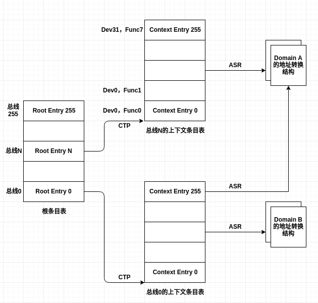

# IO 虚拟化的硬件支持

* [概述](#概述)
* [VT-d技术](#VT-d技术)
  * [DMA 重映射](#DMA-重映射)
	* [Root Entry](#Root-Entry)
	* [Context Entry](#Context-Entry)
  * [IO 页表](#IO-页表)
  * [VT-d 硬件缓存](#VT-d-硬件缓存)
  * [VT-d 硬件探测](#VT-d-硬件探测)

## 概述

评价IO虚拟化技术的两个指标如下

- 性能
- 通用性

对于高性能，最直接的方法就是使用设备直接分配的方式让客户机使用真实的物理设备；对于通用性，就需要用全虚拟化的方法，让客户机操作系统能够使用自带的驱动程序发现设备、操作设备。

客户机直接操作设备需要解决如下两个难点。

- 让客户机能够直接访问到设备真实的I/O地址空间(包括端口I/O和MMIO)。
- 让设备的内存操作直接访问到客户机的内存空间。

对上述问题1，VT-x已经能够解决。对于问题2，VT-d提供了DMA重映射技术来实现。

VT-d技术通过在北桥(MCH)上引入DMA重映射硬件，以提供设备重映射和设备直接分配的功能。**在启用VT-d的平台上，设备所有的DMA传输都会被DMA重映射硬件截获。**根据设备的IO页表，硬件可以对DMA中的地址进行转换，使设备只能访问到规定的内存。

如下图所示为设备访问内存的架构图。其中`a`是没有VT-d的平台，此时设备的DMA可以访问整个物理内存；`b`是启用VT-d，此时设备只能访问指定的物理内存。

## VT-d技术

虚拟机环境下客户机使用的是GPA，则客户机的驱动直接操作设备时也是用GPA。而设备进行DMA需要使用HPA。因此在DMA时将GPA转换成HPA就成了关键问题。VT-d提供的DMA重映射就是为解决该问题而来。

### DMA 重映射

在DMA的总线传输中包含一个BDF以标识该DMA传输是由哪个设备发起的。在VT-d技术中，标识DMA操作发起者的结构称为源标识符。

此外，VT-d还提供了两种数据结构来描述PCI架构，分别是根条目(Root Entry)和上下文条目(Context Entry)。

#### Root Entry

Root Entry用于描述PCI总线，每条总线对应一个根条目。Root Entry一起构成一张Root Entry Table。下图所示为Root Entry的结构。

主要字段如下。

- P：存在位。为0时条目无效，来自该条目所代表总线的所有DMA传输被屏蔽。为1时，该条目有效。
- CTP(Context Table Pointer)：指向上下文条目表。

#### Context Entry

Context Entry用于描述某个具体的PCI设备，这里的设备是指逻辑设备。上下文条目组成Context Entry Table。下图所示为Context Entry的结构。

主要字段如下。

- P：存在位。意义同Root Entry。
- T：类型。表示ASR字段所指数据结构的类型。目前VT-d中该字段为0，表示多级页表。
- ASR(Address Space Root)：实际是一个指针，指向T字段所代表的数据结构，目前该字段指向一个I/O页表。
- DID(域标识符)

Root Entry和Context Entry一起构成了如下所示的两级结构。

### IO 页表

IO页表是DMA重映射硬件进行地址转换的核心，IO页表的思想和CPU中的pageing机制的页表类似；只不过VT-d需要借助Root Entry和Context-Entry才能获得设备对应的IO页表。

下图所示为最典型的4KB页面转换过程如下。

通过IO页表中GPA到HPA的映射，DMA重映射硬件可以将DMA传输中的GPA转换成HPA，从而使设备直接访问指定客户机的内存区域。

### VT-d 硬件缓存

VT-d硬件使用了大量的缓存以提高效率。其中和地址转换相关的缓存称为`IOTLB`，它和CPU中的TLB功能一样。此外，Context Entry Table是Context Entry的缓存。

VT-d对上述两种缓存提供了三种粒度的刷新操作。

- 全局刷新。
- 客户机粒度刷新。
- 局部刷新。

硬件可以实现上述三种刷新操作的一种或者多种。

### VT-d 硬件探测

在使用DMA重映射硬件之前需要对它进行探测。VT-d通过BIOS的ACPI表汇报平台DMA重映射硬件的情况。

硬件主要由三个主要的数据结构描述。

- DMAR(DMA Remapping Reporting):汇报平台VT-d相关硬件的整体情况。其字段如下。

	| 字段名  | 描述 |
	|-------|:---:|
	| Length  | 以字节数表示DMAR表占用的内存大小|
	| HAW | 该平台支持的DMA操作可寻址的最大物理地址空间|
	| DMA Remapping Structures  | 指向下一级硬件描述数据结构，包括DRHD和RMRR两种|
	此处我们只关注DMA Remapping Structures字段为**DRHD**的情况。
- DRHD(DMA Remapping Hardware Unit Definition)：用于描述重映射硬件，一个DRHD结构对应一个DMA重映射硬件。DRHD的主要字段如下表

	| 字段名  | 描述 |
	|-------|:---:|
	| Flag  | 指明DMA重映射硬件截获哪些设备的DMA传输，有两种模式。 1.INCLUDE_ALL模式：截获所有设备的DMA传输 2.非INCLUDE_ALL模式：只截获来自Device 字段所描述设备的DMA传输|
	| Register Base Address | 指向DMA重映射硬件寄存器的基地址，系统软件通过读写这些寄存器操作DMA重映射硬件|
	| Device Scope  | 设备域，数组结构，成员为DSS。当DMA重映射硬件工作在非INCLUDE_A模式时，该数组所包含设备的DMA传输被当前DMA重映射硬件截获|

- DSS(Device Scope Structure)：描述DRHD所管辖的设备。DSS可以代表两种类型的设备，一种是PCI终端设备，一种是PCI桥设备。如下表所示为DSS字段。

	| 字段名  | 描述 |
	|-------|:---:|
	| Type  |指明该DSS描述的设备类型，1代表PCI设备，2代表PCI桥设备|
	| Starting Bus Nunber | 当DSS描述的设备位于某特定PCI桥下时，该PCI桥下第一条总线的总线号|
	| PCI Path  |当Type字段为PCI桥时，指明该桥所属设备的路径|

上述三种数据结构构成了下图所示的层次。

