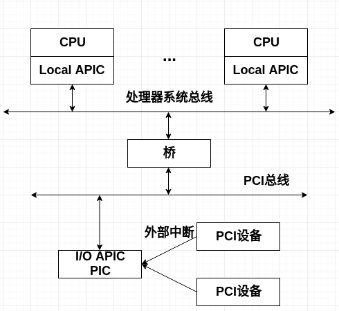
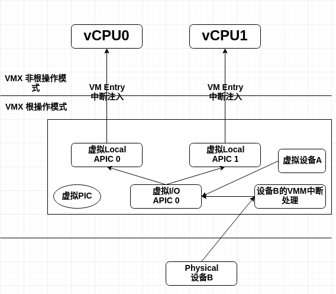
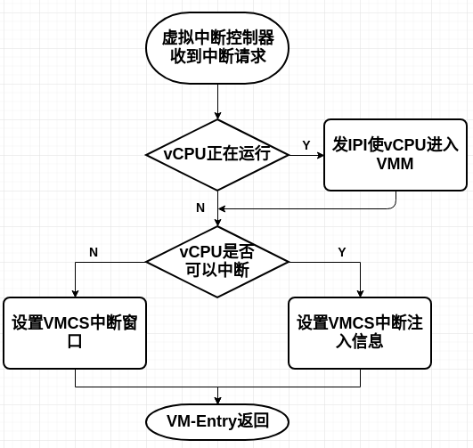

# 中断虚拟化

* [概述](#概述)
* [虚拟PIC](#虚拟PIC)
* [虚拟IO APIC](#虚拟IO-APIC)
* [虚拟Local APIC](#虚拟Local-APIC)
* [中断采集](#中断采集)
* [中断注入](#中断注入)

## 概述

在介绍中断虚拟化之前，先看一下物理平台上的中断架构。如下图所示为物理平台上的外部中断流程。

首先，I/O设备通过中断控制器(IO APIC或者PIC)发出中断请求，中断请求经由PCI总线发送到系统总线上，最后目标CPU的Local APIC部件接收中断，CPU开始处理中断。

在虚拟机环境中VMM也需要为客户机操作系统展现一个与物理中断架构类似的虚拟中断架构。下图所示为虚拟机的中断架构。

总的来说，中断虚拟化需要实现如下功能：

- 为每一个vCPU维护一个对应的虚拟Local APIC用于接收中断。
- 虚拟I/O APIC或者虚拟PIC用于发送中断。
- 虚拟Local APIC利用VT-x的事件注入机制将中断注入到相应的vCPU。

因此总的来说，中断虚拟化的任务就是要实现上图所描述的虚拟机中断架构。

## 虚拟PIC

虚拟PIC的实现其实就是根据PIC硬件规范，在软件上模拟出虚拟PIC，为虚拟机提供和物理PIC一样的接口。

虚拟PIC首先要虚拟出和物理PIC一样的软件接口。物理PIC为软件提供了如下接口用于操作PIC。

- 4个初始化命令字(Initialization Command Words)：ICW1~4，用于初始化操作。
- 3个操作命令字(Operation Command Words)：OCW1~3，用于操作PIC。

由于在IA32平台上，物理PIC的ICW1~4和OCW1~3都是通过端口访问的。因此，VMM可以设置VMCS的I/O bitmap中的相应位，使得客户机在访问这些端口时发生VM-Exit，便于VMM截获。

VMM截获这些接口的访问以后，接下来就是按照PIC硬件规范实现对这些接口的定义，实现对应逻辑。

最后虚拟PIC不仅需要为客户机提供正确的虚拟接口，还要为虚拟设备提供接口用于发送中断请求。

## 虚拟IO APIC

在物理机环境下，操作系统通过MMIO的方式访问I/O APIC。因此，VMM的实现和虚拟PIC有所不同。VMM会将虚拟I/O APIC的MMIO地址对应的页表项置为“该页不存在”。因此当客户机访问对应的MMIO寄存器时，就会发生原因为Page Fault的VM-Exit。这样，VMM就能截获客户机对虚拟I/O APIC的访问，进而正确的虚拟化。

## 虚拟Local APIC

虚拟Local APIC的最主要功能是向vCPU注入中断。在VT-x的帮助下，虚拟Local APIC可以借助VM-Entry事件注入机制简单的实现这个功能。

在物理机环境下Local APIC提供给软件的接口是MMIO寄存器，所以VMM也通过Page Fault来截获客户机对虚拟Local APIC的访问。

## 中断采集

中断的采集是指如何将虚拟机的设备中断请求送入虚拟中断控制器。在虚拟机环境里，客户机的中断有两种可能的来源。

- 来自于软件模拟的虚拟设备，例如一个模拟出来的串口，可以产生一个虚拟中断。
- 来自于直接分配给客户机的物理设备的中断，例如一块物理网卡，可以产生一个真正的物理中断。

对于虚拟设备发出的中断，直接使用虚拟PIC或者虚拟I/O APIC提供的接口。**对于真实的物理设备发出的中断则首先由VMM的中断处理函数接收，再注入给客户机。**VMM必须提前了解了解设备的分配信息。

## 中断注入

中断注入是指将中断请求按照优先级，逐一注入客户机虚拟处理器。

- 虚拟中断控制器负责将中断按照优先级排序。
- VMM调用虚拟Local APIC提供的接口来实现将中断注入客户机的最基本功能。

VMM的虚拟中断注入逻辑需要考虑如下问题。

- 目标vCPU正在物理CPU上运行。此时，为了保证中断的时效性，需要强迫vCPU发生VM-Exit。这样就可以在VM-Entry的时候注入中断。
- 目标vCPU目前无法中断。此时，使用中断窗口(Interrupt Windows)。该机制通过设置VMCS的一个特定字段，告诉物理CPU，其当前运行的客户机vCPU有一个中断需要注入。一旦客户机可以接收中断，物理CPU会主动触发VM-Exit。
- 触发中断的时机。虚拟中断控制器会根据内部的状态，如虚拟IMR/ISR寄存器的值，来决定是否需要注入中断给客户机。

下图所示为中断注入的基本逻辑。

