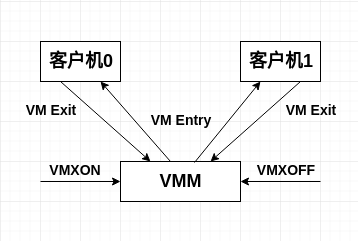

# CPU虚拟化的硬件支持
[TOC]
- - -
## 概述
_ _ _
VT-x的基本思想可参考下图：
_ _ _

_ _ _
首先，VT-x引入了两种操作模式，统称为VMX操作模式

* 根操作模式(**VMX Root Operation**)：VMM运行所处的模式，以下简称根模式。
* 非根操作模式(**VMX Non-Root Operation**)：客户机运行所处的模式，简称非根模式。

这两种操作模式都有相应的特权级0和特权级3。

* **VM-Exit**：非根模式下敏感指令引起的“陷入”。
* **VM-Entry**：该操作由VMM发起，通常是调度某个客户机运行，此时CPU从根模式切换到非根模式。

其次，为了更好的支持CPU虚拟化，VT-x引入了**VMCS**(Virtual-Machine Control Structure，虚拟机控制结构)。VMCS保存虚拟CPU和CPU的相关状态，比如CPU在根模式下和非根模式下的特权寄存器的值。VMCS主要供CPU使用，CPU在发生VM-Exit和VM-Entry时都会自动查询和更新VMCS。VMM可以通过指令来配置VMCS，进而影响CPU的行为。

最后，VT-x引入了一组新指令。

* **VMLAUNCH/VMRESUME**：发起VM-Entry。
* **VMREAD/VMWRITE**：用于配置VMCS。
- - -
## VMCS
_ _ _

* VMCS是保存在内存中的数据结构。
* 包含vCPU相关寄存器的内容和vCPU相关的控制信息。
* 每个VMCS对应一个vCPU。
* VMCS和物理CPU是一对一的绑定关系。
* VMCS在不同的时刻可以绑定到不同的物理CPU，这种变化称为VMCS的迁移(Migration)。

**此处应该思考比如一个VM有多个vCPU，那么VMCS与vCPU是如何对应的，一个VMCS对应一个vCPU的话，那么其他vCPU的相关信息该如何保存？提示：考虑vCPU的存在形式以及物理CPU的限制**

VT-x提供了两条指令用于VMCS的绑定与解除绑定。

* **VMPTRLD**：将指定的VMCS与执行该指令的物理CPU绑定。
* **VMCLEAR**：将执行该指令的物理CPU与它的VMCS解除绑定。

VT-x规定VMCS是一个最大不超过4KB的内存块，并要求4kB对齐。VMCS数据格式如下所示。
_ _ _
|字节偏移| 描述 |
|-------|:---:|
|0|VMCS revision identifier|
|4|VMX-abort indicator|
|8|VMCS data|

VMCS的主要信息存放在“VMCS数据域”，VT-x提供了两条指令用于访问VMCS。

* **VMREAD**：读取VMCS中指定的区域。
* **VMWRITE**：写VMCS中指定的域。

具体来说，VMCS数据域包括下列6大类信息。

* **客户机状态域**：保存客户机运行时，即非根模式时的CPU状态。VM-Exit，CPU保存当前状态至客户据状态域；VM-Entry，CPU从客户机状态域恢复状态。
* **宿主机状态域**：保存VMM运行时，即根模式时的CPU状态。当VM-Exit时，CPU从该域恢复CPU状态。
* **VM-Entry控制域**：控制VM-Entry的过程。
* **VM-Execution控制域**：控制处理器在VMX非根模式下的行为。
* **VM-Exit控制域**：控制VM-Exit的过程。
* **VM-Exit信息域**：提供VM-Exit原因和其他信息，该域是只读的。
- - -
## VMX操作模式
_ _ _
* **VMXON**：打开VMX操作模式。
* **VMXOFF**：关闭VMX操作模式。
_ _ _

下图所示为VMX操作模式图。
_ _ _

- - -
## VM-Entry
_ _ _
VM-Entry是指CPU由根模式切换到非根模式，本质上是指CPU从VMM切换到客户机执行。

VT-x为VM-Entry提供了两条指令。

* **VMLAUNCH**:用于执行过VMCLEAER的VMCS的第一次VM-Entry。
* **VMRESUME**:用于执行过VMLAUNCH的VMCS的后续VM-Entry。

在执行VM-Entry之前，VMM会设置好VMCS相关域的内容。

VM-Entry的过程如下。

* 执行基本检查，确保VM-Entry能执行。
* 检查VMCS中宿主机状态域的有效性，确保下一次VM-Exit时可以正确地从客户机切换到VMM。
* 检查VMCS中客户机状态域的有效性，据此装载处理器状态。
* 根据VM-Entry MSR-load装载MSR寄存器。
* 根据VM-Entry事件注入控制的配置，注入事件到客户机中。
- - -
## VM-Exit
_ _ _
VM-Exit是指CPU从非根模式切换到根模式，从客户机切换到VMM的操作。

敏感指令运行在VMX非根模式下，其行为有以下3种可能。

* 行为不变化，也不引起VM-Exit。
* 行为变化，产生VM-Exit且需要VMM截获并模拟敏感指令。
* 行为变化，但是是否产生VM-Exit可以通过VM-Execution域控制。

VM-Execution控制域主要用于控制CPU在非根模式运行时的行为。其主要控制三个方面。

* 控制某敏感指令是否产生VM-Exit。
* 若某些敏感指令不产生VM-Exit，控制该指令的行为。
* 异常和中断是否产生VM-Exit。

VM-Exit控制域规定了VM-Exit发生时CPU的行为。

VM-Exit信息域保存了VM-Exit时的相关信息，比如Exit原因。

一个具体的VM-Exit过程大致如下。

* CPU记录VM-Exit的原因到VMCS相应域中，VM-Entry interruption-information字段的有效位被清零。
* CPU状态被保存到客户机状态域。
* 根据VMCS中宿主机状态域和VM-Exit控制域的设置，将宿主机状态加载到CPU相应寄存器。
* CPU由非根模式切换到根模式，从宿主机状态域中CS:RIP指定的VM-Exit入口函数开始执行。
* * *
# CPU虚拟化的实现
- - -
## 概述
_ _ _
硬件虚拟化使用vCPU描述符来描述vCPU。vCPU描述符类似操作系统中进程描述符，本质上是一个结构体，通常由下列几部分构成。

* vCPU标识信息:vCPU的一些属性，如ID号，vCPU属于哪个客户机等。
* 虚拟寄存器信息:虚拟的寄存器资源，在VT-x的情况下，这些资源保存在VMCS中。
* vCPU状态信息:标识该vCPU当前所处的状态。
* 额外寄存器/部件信息:主要指未包含在VMCS中的一些寄存器或CPU部件。
* 其他信息:用于VMM进行优化。

整个客户机的运行实际上可以看作是VMM调度不同的vCPU运行。
- - -
## vCPU的创建
_ _ _
创建vCPU实际上是创建vCPU描述符，由于vCPU描述符本质上是一个结构体，因此创建vCPU描述符就是分配相应大小的内存。

vCPU描述符在创建之后，需要进一步初始化才能使用。VMCS的创建与初始化是vCPU创建的重要组成部分。
- - -
## vCPU的运行
_ _ _

vCPU创建并初始化好之后，就可以通过调度程序被调度执行。
- - -

### 上下文切换
_ _ _
在VT-x的支持下，vCPU的上下文可以分为两部分(硬件使用的VMCS以及VMM所维护的部分)。频繁的上下文切换会带来不小的性能开销，VMM使用“惰性保存/恢复”的方法进行优化，其基本思想是尽量将寄存器的保存/恢复延迟到最后一刻。
- - -
### vCPU的硬件优化
_ _ _
VT-x提供的优化分为如下两种。

* 无条件优化:是指以往在软件虚拟化下必须陷入到VMM中的敏感指令，通过VT-x已可以在客户机中直接执行。
* 条件优化:是指通过VMCS的VM-Execution控制域，可以配置某些敏感指令是否产生VM-Exit而陷入到VMM中。
- - -
## vCPU的退出
_ _ _
vCPU的退出在VT-x中表现为发生VM-Exit。vCPU的退出大体u上可以分为如下三类。

* 访问了特权资源。
* 客户机执行的指令发生了异常。
* 发生了中断(1.真正的物理中断 2.客户机的虚拟设备发生了中断)。
- - -
## vCPU的再运行
_ _ _
VMM在处理完vCPU的退出后，会负责将vCPU投入再运行。对于vCPU的再运行有以下两种情况。

* vCPU继续在相同的物理CPU上运行，直接使用VMRESUME来实现。
* 如果vCPU被调度迁移到另外一个物理CPU上，VMM需要做如下几件事情:
	1.将vCPU对应的VMCS迁移到另一个物理CPU，这通常由一个IPI中断来实现。
	2.迁移完成后，在重新绑定的物理CPU上执行VMLAUNCH发起VM-Entry。