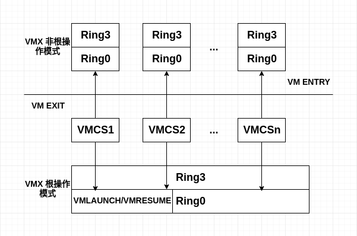

# CPU虚拟化的硬件支持
- - -
## 概述
_ _ _
VT-x的基本思想可参考下图：
_ _ _

_ _ _
首先，VT-x引入了两种操作模式，统称为VMX操作模式

* 根操作模式(**VMX Root Operation**)：VMM运行所处的模式，以下简称根模式。
* 非根操作模式(**VMX Non-Root Operation**)：客户机运行所处的模式，简称非根模式。

这两种操作模式都有相应的特权级0和特权级3。

* **VM-Exit**：非根模式下敏感指令引起的“陷入”。
* **VM-Entry**：该操作由VMM发起，通常是调度某个客户机运行，此时CPU从根模式切换到非根模式。

其次，为了更好的支持CPU虚拟化，VT-x引入了**VMCS**(Virtual-Machine Control Structure，虚拟机控制结构)。VMCS保存虚拟CPU和CPU的相关状态，比如CPU在根模式下和非根模式下的特权寄存器的值。VMCS主要供CPU使用，CPU在发生VM-Exit和VM-Entry时都会自动查询和更新VMCS。VMM可以通过指令来配置VMCS，进而影响CPU的行为。

最后，VT-x引入了一组新指令。

* **VMLAUNCH/VMRESUME**：发起VM-Entry。
* **VMREAD/VMWRITE**：用于配置VMCS。
- - -
## VMCS
_ _ _

* VMCS是保存在内存中的数据结构。
* 包含vCPU相关寄存器的内容和vCPU相关的控制信息。
* 每个VMCS对应一个vCPU。
* VMCS和物理CPU是一对一的绑定关系。
* VMCS在不同的时刻可以绑定到不同的物理CPU，这种变化称为VMCS的迁移(Migration)。

**此处应该思考比如一个VM有多个vCPU，那么VMCS与vCPU是如何对应的，一个VMCS对应一个vCPU的话，那么其他vCPU的相关信息该如何保存？提示：考虑vCPU的存在形式以及物理CPU的限制**

VT-x提供了两条指令用于VMCS的绑定与解除绑定。

* **VMPTRLD**：将指定的VMCS与执行该指令的物理CPU绑定。
* **VMCLEAR**：将执行该指令的物理CPU与它的VMCS解除绑定。

VT-x规定VMCS是一个最大不超过4KB的内存块，并要求4kB对齐。VMCS数据格式如下所示。
_ _ _
|字节偏移| 描述 |
|-------|:---:|
|0|VMCS revision identifier|
|4|VMX-abort indicator|
|8|VMCS data|

VMCS的主要信息存放在“VMCS数据域”，VT-x提供了两条指令用于访问VMCS。

* **VMREAD：**读取VMCS中指定的区域。
* **VMWRITE：**写VMCS中指定的域。

具体来说，VMCS数据域包括下列6大类信息。

* **客户机状态域：**保存客户机运行时，即非根模式时的CPU状态。VM-Exit，CPU保存当前状态至客户据状态域；VM-Entry，CPU从客户机状态域恢复状态。
* **宿主机状态域：**保存VMM运行时，即根模式时的CPU状态。当VM-Exit时，CPU从该域恢复CPU状态。
* **VM-Entry控制域：**控制VM-Entry的过程。
* **VM-Execution控制域：**控制处理器在VMX非根模式下的行为。
* **VM-Exit控制域：**控制VM-Exit的过程。
* **VM-Exit信息域：**提供VM-Exit原因和其他信息，该域是只读的。
- - -
