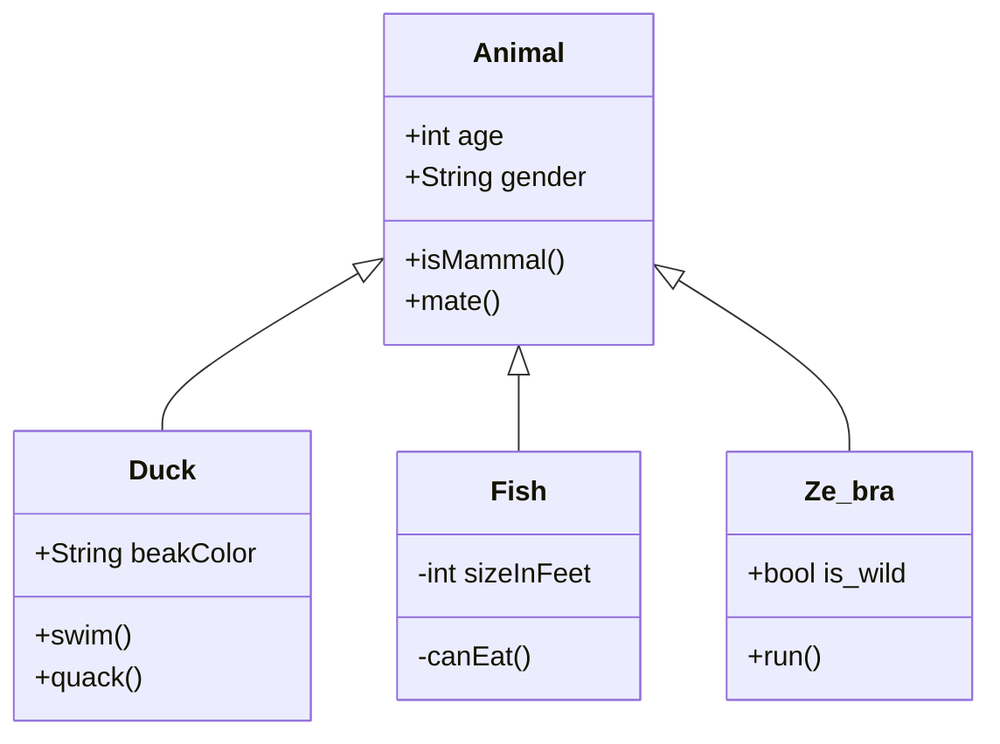

# mylearn
记录学习

```mermaid.js
 classDiagram
      Animal <|-- Duck
      Animal <|-- Fish
      Animal <|-- Ze_bra
      Animal : +int age
      Animal : +String gender
      Animal: +isMammal()
      Animal: +mate()
      class Duck{
          +String beakColor
          +swim()
          +quack()
      }
      class Fish{
          -int sizeInFeet
          -canEat()
      }
      class Ze_bra{
          +bool is_wild
          +run()
      }
```
