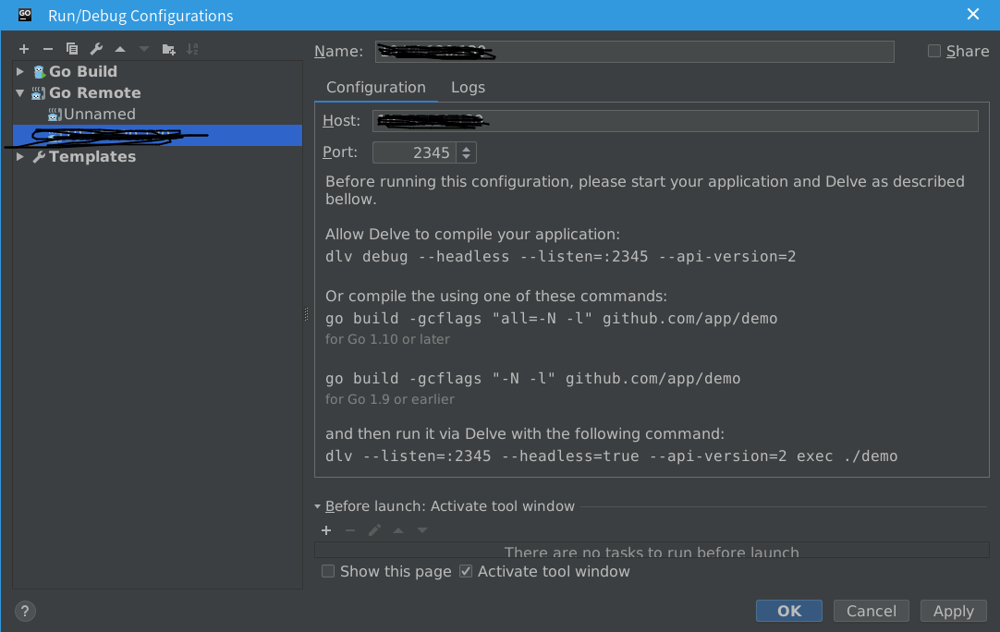
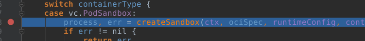

- [1. kata](#1-kata)
  - [1.1. runtime](#11-runtime)
  - [1.2. agent](#12-agent)
  - [1.3. shim](#13-shim)
  - [1.4. proxy](#14-proxy)
- [2. kvm](#2-kvm)
- [3. qemu](#3-qemu)
- [4. docker](#4-docker)
- [5. kubernetes](#5-kubernetes)
- [6. git](#6-git)
  - [6.1. 配置代理](#61-%E9%85%8D%E7%BD%AE%E4%BB%A3%E7%90%86)
- [7. linux](#7-linux)
  - [7.1. 命令](#71-%E5%91%BD%E4%BB%A4)
- [8. CI](#8-ci)
  - [8.1. kata](#81-kata)
    - [8.1.1. 本地做静态检查](#811-%E6%9C%AC%E5%9C%B0%E5%81%9A%E9%9D%99%E6%80%81%E6%A3%80%E6%9F%A5)
    - [8.1.2. 配置 docker 使用 kata-runtime](#812-%E9%85%8D%E7%BD%AE-docker-%E4%BD%BF%E7%94%A8-kata-runtime)
      - [8.1.2.1. i. systemd](#8121-i-systemd)
      - [8.1.2.2. ii. Docker daemon.json](#8122-ii-docker-daemonjson)
      - [8.1.3. 登入 kata 虚拟机](#813-%E7%99%BB%E5%85%A5-kata-%E8%99%9A%E6%8B%9F%E6%9C%BA)
- [9. kernel](#9-kernel)
  - [9.1. cgroup](#91-cgroup)
- [10. golang](#10-golang)
  - [10.8. goroutine 和通道](#108-goroutine-%E5%92%8C%E9%80%9A%E9%81%93)
    - [10.8.1. goroutine](#1081-goroutine)
    - [10.8.2. 并发时钟服务器](#1082-%E5%B9%B6%E5%8F%91%E6%97%B6%E9%92%9F%E6%9C%8D%E5%8A%A1%E5%99%A8)
    - [10.8.3. 通道](#1083-%E9%80%9A%E9%81%93)
      - [10.8.3.1. 无缓冲通道](#10831-%E6%97%A0%E7%BC%93%E5%86%B2%E9%80%9A%E9%81%93)
      - [10.8.3.2. 管道](#10832-%E7%AE%A1%E9%81%93)
      - [10.8.3.3. 单向通道类型](#10833-%E5%8D%95%E5%90%91%E9%80%9A%E9%81%93%E7%B1%BB%E5%9E%8B)
      - [10.8.3.4	缓冲通道](#10834-%E7%BC%93%E5%86%B2%E9%80%9A%E9%81%93)
    - [10.8.4. 并行循环](#1084-%E5%B9%B6%E8%A1%8C%E5%BE%AA%E7%8E%AF)
    - [10.8.5. 示例：并发的 Web 爬虫](#1085-%E7%A4%BA%E4%BE%8B%E5%B9%B6%E5%8F%91%E7%9A%84-web-%E7%88%AC%E8%99%AB)
    - [10.8.6. 使用 select 多路复用](#1086-%E4%BD%BF%E7%94%A8-select-%E5%A4%9A%E8%B7%AF%E5%A4%8D%E7%94%A8)
- [11. 工具使用](#11-%E5%B7%A5%E5%85%B7%E4%BD%BF%E7%94%A8)
  - [11.1. 使用 goland 和 dlv 远程调试 kata](#111-%E4%BD%BF%E7%94%A8-goland-%E5%92%8C-dlv-%E8%BF%9C%E7%A8%8B%E8%B0%83%E8%AF%95-kata)
# 1. kata

## 1.1. runtime

## 1.2. agent

## 1.3. shim

## 1.4. proxy

# 2. kvm

# 3. qemu

# 4. docker

# 5. kubernetes

# 6. git

## 6.1. 配置代理

当处于内网环境时，需要配置代理才能从命令行访问 github，配置方法如下(公司内网代理为proxy.liang.com.cn:80):

```shell
git config --global http.proxy proxy.liang.com.cn:80
```

```shell
git config --global https.proxy proxy.liang.com.cn:80
```

# 7. linux

## 7.1. 命令

(1) 查看当前系统的内核编译选项方法如下:

```shell
cat /boot/config-`uname -r`
```

(2) 查看进程关系

```shell
ps xf -o pid,ppid,stat,args
```

```shll
ps axf
```

(3) push 代码到 gerrit 的 master 分支

```shell
git push origin HEAD:refs/for/master
```

(4) push 代码到 git 的 master 分支

```shell
git push -u origin master   // -u 参数，将本地 master 分支和远程 master 分支关联起来
```

(5) 使用 journalctl 查看 kata-runtime 日志

```shell
journalctl -f -t kata-runtime --since now
journalctl -t kata-runtime --since '1 min ago' > tmp.log
```

(6) 查看 json 格式的配置文件

```shell
cat config.json | python -m json.tool
```

(7) 查看 nat 的 iptables 规则

```shell
iptables -t nat -S
```

(8) 查看路由信息

```shell
ip r
```

(9) 虚拟机没有 vi 或者 vim 命令时，可以使用如下方式创建 shell 脚本

```shell
cat <<EOF | tee /home/test1.sh
#!/bin/bash
while ((1));
    do echo test > /dev/null;
done
EOF
```

# 8. CI

## 8.1. kata

### 8.1.1. 本地做静态检查

以 runtime 为例，进入到 runtime 代码目录下执行如下命令:

1. export KATA_DEV_MODE=true
2. export KATA_CI_NO_NETWORK=true
3. make check
4. make test

### 8.1.2. 配置 docker 使用 kata-runtime

#### 8.1.2.1. i. systemd

```shell
sudo mkdir -p /etc/systemd/system/docker.service.d/
cat <<EOF | sudo tee /etc/systemd/system/docker.service.d/kata-containers.conf
[Service]
ExecStart=
ExecStart=/usr/bin/dockerd -D --add-runtime kata-runtime=/usr/bin/kata-runtime --default-runtime=kata-runtime
EOF
```

#### 8.1.2.2. ii. Docker daemon.json

Add the following definitions to /etc/docker/daemon.json:

```json
{
  "default-runtime": "kata-runtime",
  "runtimes": {
    "kata-runtime": {
      "path": "/usr/bin/kata-runtime"
    }
  }
}
```

#### 8.1.3. 登入 kata 虚拟机

```shell
socat "stdin,raw,echo=0,escape=0x11" "unix:/run/vc/vm/${sandbox-id}/console.sock"
```

# 9. kernel

## 9.1. cgroup

# 10. golang

## 10.8. goroutine 和通道

### 10.8.1. goroutine

goroutine 通过在函数或者方法调用前加上go关键字前缀。

```go
f()       //调用f()，等待它返回
go f()    //新建一个调用f()的goroutine，不用等待
```

### 10.8.2. 并发时钟服务器
该服务器以每秒钟一次的频率向客户端发送当前时间：

```go
// clock1.go
// clock1是一个定期报告时间的 TCP 服务器
package main

import (
    "io"
    "log"
    "net"
    "time"
)

func main() {
    listener, err := net.Listen("tcp", "localhost:8000")
    if err != nil {
        log.Fatal(err)
    }
    for {
        conn, err := listener.Accept()
        if err != nil {
            log.Print(err)
            continue
        }so
        handleConn(conn) //一次处理一个连接
    }
}

func handleConn(c net.Conn) {
    defer c.Close()
    for {
        _, err := io.WriteString(c, time.Now().Format("15:04:05\n"))
        if err != nil {
            return
        }
        time.Sleep(1 * time.Second)
    }
}
```

实现一个 net.Dial 实现的 go 版 netcat 来连接 TCP 服务器：

```go
// netcat1.go
// netcat1 是一个只读的 TCP 客户端程序
package main

import (
    "io"
    "log"
    "net"
    "os"
)

func main() {
    conn, err := net.Dial("tcp", "localhost:8000")
    if err != nil {
        log.Fatal(err)
    }
    defer conn.Close()
    mustCopy(os.Stdout, conn)
}

func mustCopy(dst io.Writer, src io.Reader) {
    if _, err := io.Copy(dst, src); err != nil {
        log.Fatal(err)
    }
}

```

把上述服务端 

```go
handleConn(conn) 函数前面加上 go 关键字，则可以处理多个客户端的连接。
```

### 10.8.3. 通道

goroutine 是 Go 程序并发的执行体，**通道**就是它们之间的连接。通道是可以让一个 goroutine 发送特定值到另一个 goroutine 的通信机制。

```go
chan int            //一个int类型元素的通道
ch := make(chan int)//使用内置函数来创建通道，ch是make函数创建的数据结构的引用
ch1 := make(chan int)
if ch1 == ch        //ch和ch1必须是同种类型的通道才能比较，当ch和ch1是同一通道数据的引用时，比较值为true
```

通道有两个主要操作：**发送(send)**和**接收(receive)**，两者统称为通信。两个操作都使用**<-**操作符书写。

```go
ch <- x      //发送语句， x的值发送给通道ch
x = <- ch   //从ch中接收到的值赋给x
<-ch        //接收通道ch中的值，但是丢弃结果
```

通道支持第三个操作：**关闭(close)**，该操作设置一个标志位来指示值当前已经发送完毕，这个通道后面没有值了；关闭后的发送操作将导致**宕机**。

在一个已经关闭的的通道上进行接收操作，将获取所有已经发送的值，直到通道为空；这时任何接受操作会立即完成，同时获取到一个通道元素对应的零值。

```go
close(ch)   //调用内置的close函数来关闭通道
```

通道分为**无缓冲通道**和**缓冲通道**。

```go
ch = make(chan int)     //无缓冲通道
ch = make(chan int, 0)  //无缓冲通道
ch = make(chan int, 3)  //容量为3的缓冲通道
```

#### 10.8.3.1. 无缓冲通道 

在无缓冲通道上，如果发送操作先执行，则发送操作会阻塞，直到另一个goroutine在同一个通道上执行接收操作。接收操作同理。

使用无缓冲通道进行的通信导致发送和接收 goroutine 同步化，因此无缓冲通道也被称为**同步通道**。

#### 10.8.3.2. 管道

通道可以用来连接 goroutine，这样一个的输出是另一个的输入，这个叫**管道(pipeline)**。

如下是一个管道的例子。

```go
// pipeline1.go
package main

import (
    "fmt"
)

func main() {
    naturals := make(chan int)
    squares := make(chan int)

    //counter
    go func() {
        for x := 0; ; x++ {
            naturals <- x
        }
    }()

    //squarer
    go func() {
        for {
            x := <-naturals
            squares <- x * x
        }
    }()

    //printer (在主 goroutine 中)
    for {
        fmt.Println(<-squares)
    }
}
```

上述代码会输出无限的平方序列0,1,4,9，...。

对于有限的数据，发送方可以通过内置函数close来来告诉接收者所在goroutine可以停止等待。

```go
//(1)通道关闭后，任何后续的发送操作将会导致应用崩溃。
//(2)当关闭的通道被读完后，所有后续的接收操作顺畅进行，只是获取到的是零值。
close(naturals)
```

可以通过接收操作的一个变种来判断通道是否已经关闭。

```go
//squarer
go func() {
    for {
        x, ok := <-naturals
        if !ok {
            break
        }
        squares <- x * x
    }
    close(squeres)
} ()
//此处接收操作产生两个结果：
//(1)接收到的通道元素
//(2)以及一个布尔值，该布尔值为true的时候代表接收成功，false表示当前的接收操作在一个关闭的并且读完的通道上
```

上述接收操作的变种语法也可以使用 **range** 循环语法以在通道上迭代。代码如下：

```go
// pipeline2.go
package main

import (
    "fmt"
)

func main() {
    naturals := make(chan int)
    squares := make(chan int)

    // counter
    go func() {
        for x := 0; x < 100; x++ {
            naturals <- x
        }
        close(naturals)
    }()

    // squarer
    go func() {
        for x := range naturals {
        squares <- x * x
        }
        close(squares)
    }()

    // printer(在主 goroutine 中)
    for x := range squares {
        fmt.Println(x)
    }
}

```

注意，关闭一个已经关闭的通道会导致宕机。

#### 10.8.3.3. 单向通道类型

上一节使用了三个 goroutine ，两个通道来通信。可以将其划分为三个子函数：

```go
func counter(out chan int)
func squarer(out, in chan int)
func printer(in chan int)
```

三个子函数的划分虽然使得代码结构更加明晰，但是却过于累赘。首先counter函数只提供发送功能，printer函数只提供接收功能，squarer函数既需要接收功能又需要发送功能。Go的类型系统提供了单向通道类型对上述的功能做限制。

以单向通道的原则改写pipeline：

```go
package main

import (
    "fmt"
)

func counter(out chan<- int) {
    for x := 0; x < 10; x++ {
        out <- x
    }
    close(out)
}

func squarer(in <-chan int, out chan<- int) {
    for x := range in {
        out <- x * x
    }
    close(out)
}

func printer(in <-chan int) {
    for x := range in {
        fmt.Println(x)
    }
}

func main() {
    naturals := make(chan int)
    squares := make(chan int)
    go counter(naturals)
    go squarer(naturals, squares)
    printer(squares)
}

```

在任何赋值操作中将双向通道转换为单向通道都是允许的，但是反过来却不行。

#### 10.8.3.4	缓冲通道

缓冲通道有一个元素队列，队列的最大长度在创建的时候通过 make 的容量参数来设置。

```go
//创建一个可以容纳三个字符串的缓冲通道
//缓冲通道上的发送操作在队列的尾部插入一个元素
//接收操作从队列的头部移除一个元素
//通道满，发送操作会阻塞；通道空，接收操作会阻塞
ch = make(chan string, 3)

//调用内置的 cap 函数获取缓冲区的容量
cap(ch)

//调用内置的 len 函数获取通道内的元素个数
len(ch)
```

在内存无法提供缓冲容量的情况下，可能导致程序**死锁**。

### 10.8.4. 并行循环

### 10.8.5. 示例：并发的 Web 爬虫

### 10.8.6. 使用 select 多路复用

下面的程序对火箭发射进行倒计时。time.Tick 函数返回一个通道，该通道定期发送事件，像一个节拍器。

```go
func main() {
    fmt.Println("Commencing countdown.")
    tick := time.Tick(1 * time.Second)
    for countdown := 10; countdown > 0; countdown-- {
        fmt.Println(countdown)
        <-tick
    }
    launch()
}
```

此外，如下函数在倒计时进行时按下回车键来取消发射。

```go
abort := make(chan struct{})
go func() {
    os.Stdin.Read(make([]byte, 1))
    abort <- struct{}{}
}()
```

如上所述每一次倒计时迭代需要等待事件到达两个通道中的一个。这种场景下需要使用多路复用，多路复用由 select 表示：

```go
select {
    case <-ch1remotes/origin/master
        // ...remotes/origin/master
    case x := <-ch2
        // ...use x...
    case ch3 <- y
        // ...
    default:
        // ...
}
```

# 11. 工具使用

## 11.1. 使用 goland 和 dlv 远程调试 kata

1.配置 /etc/docker/daemon.json 文件：

```json
{
  "runtimes": {
        "kata-runtime": {
            "path": "/usr/bin/kata-runtime"
        },
        "dlv": {
            "path": "/usr/bin/kata-runtime.swapper"
        }
    },
  "default-runtime": "kata-runtime",

  "storage-driver":"devicemapper"
}
```

2.kata-runtime.swapper 脚本：

```shell
#!/bin/bash

passby=true

logger -t swapper -- "start dlv headless server, waiting client connecting..."
/usr/local/go/bin/dlv exec --api-version=2 --headless --listen=:2345 --log --log-output=rpc /usr/bin/kata-runtime -- $@ 2>&1 |tee -a /tmp/dlv.log
logger -t swapper -- "dlv headless server stopped."
```

3.将 dlv 二进制文件放到如下目录：

```shell
/usr/local/go/bin/
```

4.使用软链接生成 kata-runtime.swapper 可执行文件：

```shell
cd /usr/bin/
ln -sf ${youDirectory}/kata-runtime.swapper.sh kata-runtime.swapper
```

5.配置 goland，下图中的 Host 和 Port 用于填写远程被调试主机的 IP 地址以及开放的端口号：



6.在 10.74.120.130 上 执行如下命令

```shell
docker run --runtime dlv -d -ti busybox /bin/sh
```

7.在 goland 中于如下代码处加上断点：

```go
process, err = createSandbox(ctx, ociSpec, runtimeConfig, containerID, bundlePath, console, disableOutput, systemdCgroup)
```

8.点击 Debug，代码就会断在7中断点处，接下来就可以进行单步调试了:


